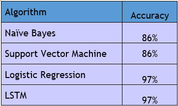

# Twitter-Sentiment-Analysis-Covid-19
This work begins by collecting a dataset of tweets with twitter-streaming API regarding COVID-19 and classifying them according to the sentiment that is expressed: positive, negative or neutral

Here is the <a href="https://github.com/zackhr/Twitter-Sentiment-Analysis-Covid-19/blob/main/project_twitter.ipynb"> PROJECT </a>

<h2>twitter data about covid is extracted between 2020/10/16 and 2020/11/06</h2>

 <h2>the results of some algorithms used:</h2>
 
 
 
